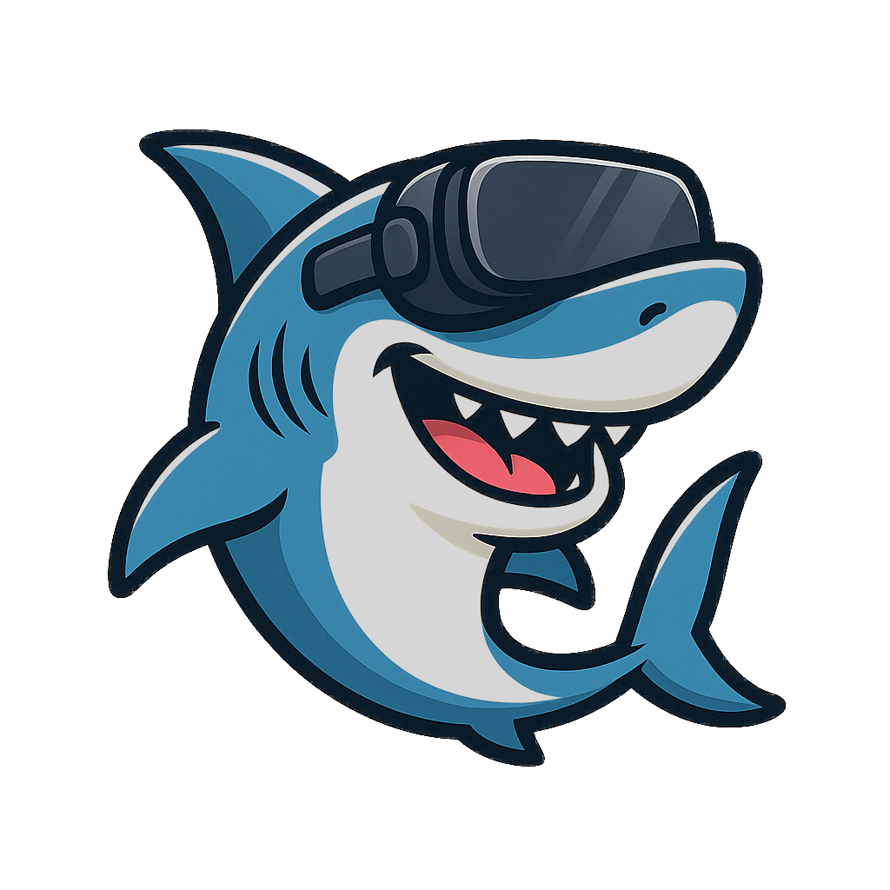
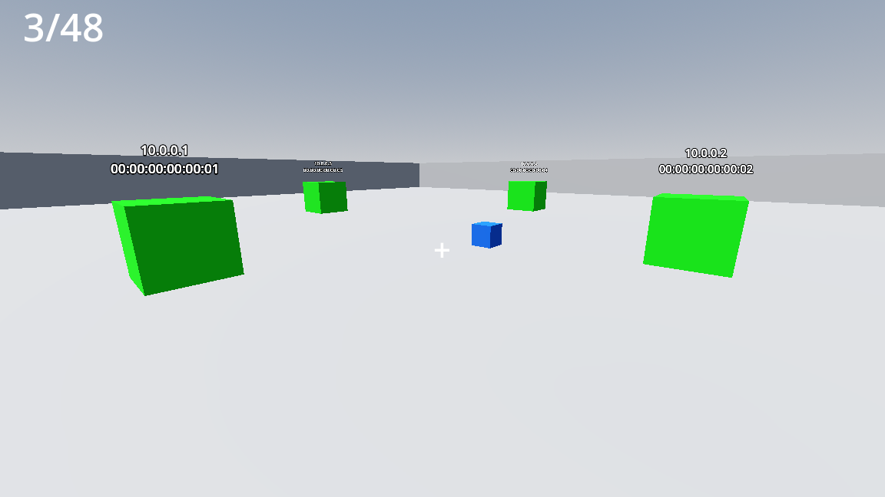
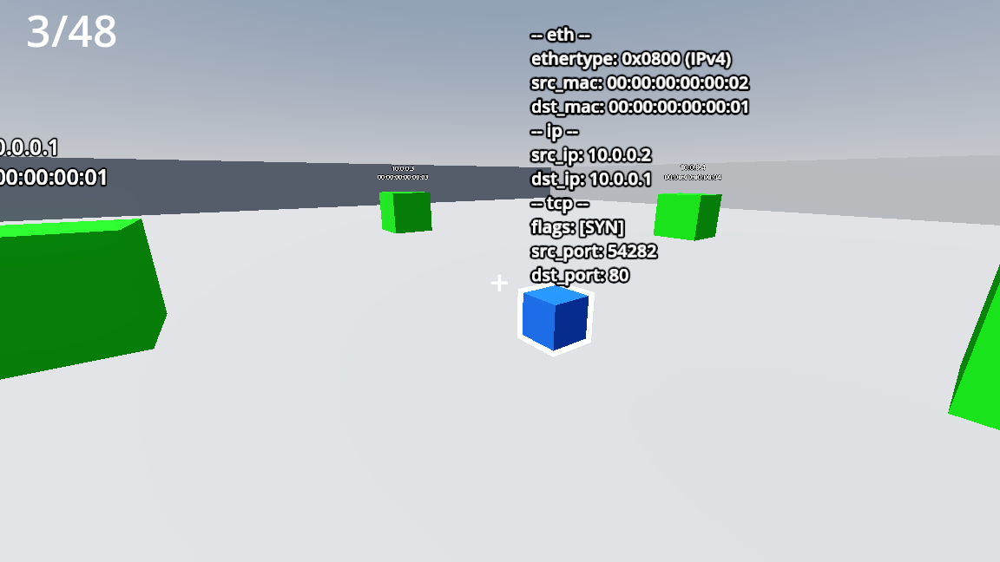
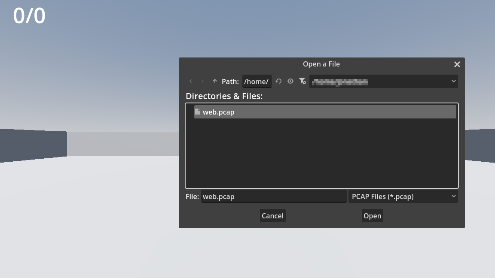
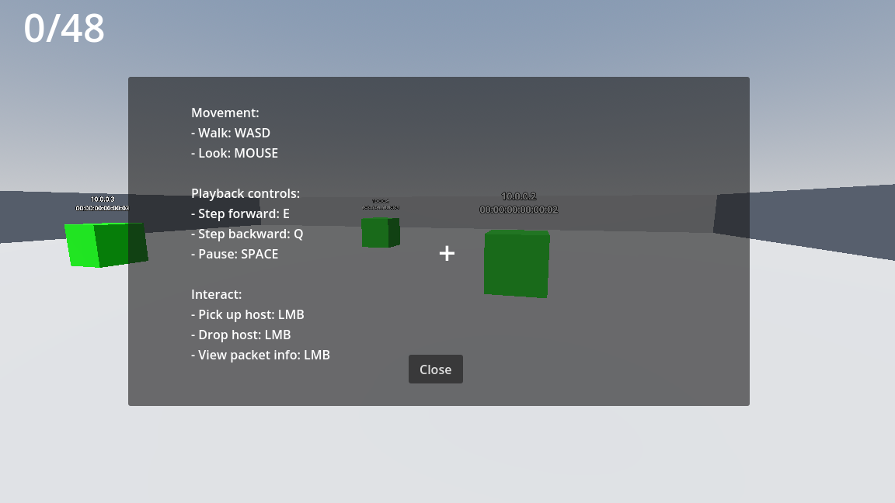

# VRshark

 
VRshark is an application for visualizing network traffic in 3D, written in the
Godot game engine using mainly GDScript.  
 

  

Wireshark already exist as a popular open-source application for reading
PCAP-files or even live traffic by listening to interfaces on the host.
Wireshark supports many protocols and you can analyze packets in detail. 

  

So why analyze the packets in 3D/VR? The visual representation of traffic
flow adds another dimension to trouble-shooting and anomaly detection by
network administrators. It can also be used in an educational setting,
enhancing the learning experience when it comes to protocols and routing
on the Internet.

Godot was chosen as the platform for mainly two reasons: (1) it was open-source,
and (2) it had support for XR (eXtended Reality) which includes VR and AR.
VRshark has three development phases: 3D, VR, and AR.
As a prototype, VRshark is developed as a 3D game with keyboard and mouse controls.
When the core functionality and traffic representation in a 3D space has been
established, then the project will be ported to VR, and then finally AR.
Currently, the project is in the prototype (3D) phase and will later be tagged
as "prototype" when moving forward to VR and AR.

The core functionality includes being able to read a PCAP-file, spawning objects
representing hosts, relocating said objects, and controlling the playback of the
traffic with visual representations of the packets which can be inspected closer.  

  

  

The playback controller should be able to play/pause as well as step both forwards and
backwards through the PCAP-file at different speeds.

## How to run
1. Install [Godot](https://godotengine.org/)
2. Clone this repository
	- `git clone git@github.com:Arcnilya/vrshark.git`
3. Start Godot and open the `vrshark` project directory
4. Click the "play-arrow" in the top right or press F5

## TODO
- [ ] Move to VR
    - [ ] New HUD/GUI
- [ ] Represent packet size
- [ ] Represent packet type with colors
- [ ] Extend playback controller
    - [ ] Continuous play
    - [ ] Speed up and slow down
